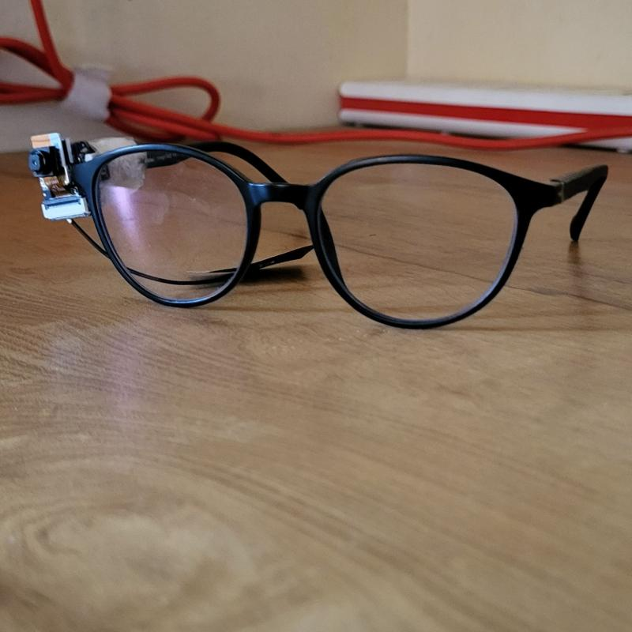
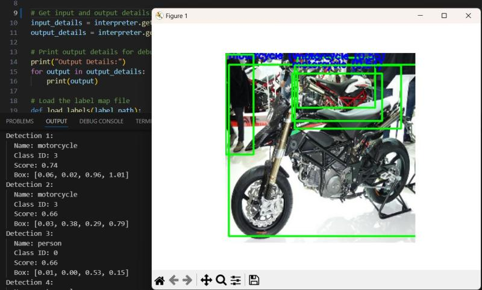

# Echo Frame - Real-Time Object Detection with Audio Feedback

<table>
<tr>
<td width="60%">

## Project Overview

Echo Frame is a real-time object detection system with audio feedback, designed for accessibility applications. The system uses **EfficientDet-Lite0** for accurate object detection and provides spoken feedback through text-to-speech, making it particularly useful for visually impaired users.

The project includes a fully functional **laptop/desktop application** with webcam support and is being prepared for deployment on **Xiao ESP32-S3 Sense** microcontrollers for a portable, standalone device.

</td>
<td>




</td>
</tr>
</table>

## Architecture

```
Camera Input → EfficientDet-Lite0 (TFLite) → Object Detection → Audio Feedback (TTS)
```

## Features

- **Real-time Detection**: Live webcam object detection at 15-30 FPS
- **EfficientDet-Lite0**: State-of-the-art mobile detection model (better than MobileNet V2)
- **Audio Feedback**: Announces detected objects via text-to-speech
- **Interactive Controls**: Adjust confidence threshold, mute/unmute on the fly
- **Accessibility Focus**: Designed for visually impaired users
- **Modular Design**: Clean, organized codebase with separate modules
- **ESP32 Ready**: Optimized for Xiao ESP32-S3 Sense deployment

## Project Structure

```
echo-frame/
├── main.py                      # Main application (run this!)
├── requirements.txt             # Python dependencies
├── README.md
│
├── src/                         # Source code modules
│   ├── detector.py             # Object detection logic
│   ├── audio.py                # Audio feedback system
│   ├── camera.py               # Camera/webcam handling
│   ├── visualizer.py           # Drawing detections
│   └── utils.py                # Helper functions
│
├── models/                      # Model files
│   └── model.tflite            # EfficientDet-Lite0 (4.35 MB)
│
├── data/                        # Data files
│   └── labels.txt              # 80 COCO object classes
│
├── images/                      # Test images
│   ├── car.jpg
│   ├── sample.jpg
│   └── ...
│
├── scripts/                     # Utility scripts
│   ├── download_model.py       # Download model from TF Hub
│   └── quantize_model.py       # Quantize model for ESP32
│
└── tests/                       # Test scripts
    └── test_image.py           # Test on single image
```

## Quick Start

### Prerequisites

- Python 3.8+
- Webcam
- Linux/Windows/macOS

### Installation

1. **Clone the repository**:

   ```bash
   git clone https://github.com/roshinjimmy/echo-frame.git
   cd echo-frame
   ```

2. **Create virtual environment** (recommended):

   ```bash
   python -m venv venv
   source venv/bin/activate  # On Windows: venv\Scripts\activate
   ```

3. **Install dependencies**:

   ```bash
   pip install -r requirements.txt
   ```

4. **Install system dependencies** (Linux only):

   ```bash
   # For text-to-speech
   sudo apt-get install espeak espeak-data libespeak-dev
   ```

### Running the Application

```bash
python main.py
```

### Controls

- **`q`** - Quit application
- **`s`** - Toggle audio on/off
- **`+`** - Increase confidence threshold (fewer detections)
- **`-`** - Decrease confidence threshold (more detections)

### Test on Single Image

```bash
python tests/test_image.py images/sample.jpg
```

## Target Hardware

**Xiao ESP32-S3 Sense**

- **Processor**: Dual-core Xtensa LX7 @ 240MHz
- **Memory**: 8MB PSRAM, 8MB Flash
- **Camera**: OV2640 (built-in)
- **Microphone**: Built-in digital microphone
- **Size**: 21mm x 17.5mm (ultra-compact)
- **Connectivity**: WiFi, Bluetooth 5.0

### ESP32 Deployment Status

**In Progress**: Preparing for Xiao ESP32-S3 Sense deployment
- Model optimized (4.35 MB EfficientDet-Lite0)
- TFLite format ready
- ESP32 firmware in development
- Camera integration pending
- Audio output via I2S pending

Expected performance on ESP32:
- **FPS**: 2-5 frames per second
- **Latency**: 200-500ms per detection
- **Input**: 320x320 resolution
- **Power**: Battery-powered capable

## Technical Details

### Model Information

- **Model**: EfficientDet-Lite0
- **Source**: TensorFlow Hub
- **Size**: 4.35 MB (TFLite)
- **Input**: 320x320x3 RGB images
- **Output**: Bounding boxes, class IDs, confidence scores
- **Classes**: 80 COCO objects (person, car, dog, etc.)
- **Format**: TensorFlow Lite (quantized)

### Performance Benchmarks

**Laptop/Desktop (Intel i5/Ryzen 5):**
- FPS: 15-30
- Latency: 30-60ms per frame
- Accuracy: ~35% mAP (COCO)

**Xiao ESP32-S3 Sense (Expected):**
- FPS: 2-5
- Latency: 200-500ms per frame
- Accuracy: ~33% mAP (slight drop due to quantization)

### Dependencies

```
tensorflow>=2.13.0
opencv-python>=4.8.0
numpy>=1.24.0
pyttsx3>=2.90
pillow>=10.0.0
```

## Project Status

### Completed

- Real-time object detection with webcam
- Audio feedback system with TTS
- EfficientDet-Lite0 model integration
- Interactive controls (threshold adjustment, mute)
- Modular, clean codebase
- Model download and quantization scripts
- Test utilities for images
- COCO dataset labels (80 classes)

### In Progress

- Xiao ESP32-S3 Sense firmware
- ESP32 camera integration
- I2S audio output for ESP32
- Power optimization for battery use

### Planned Features

- Object tracking across frames
- Custom object training
- Multiple language support
- Mobile app integration
- Cloud connectivity (optional)

## Detected Objects

The system can detect 80 common objects from the COCO dataset

## License

This project is open source and available for educational and research purposes.